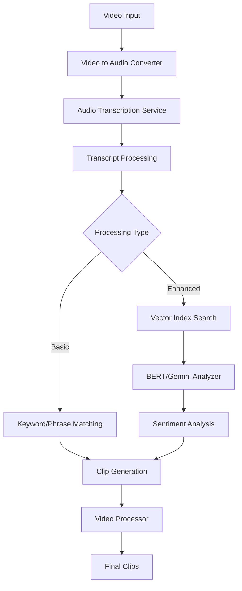
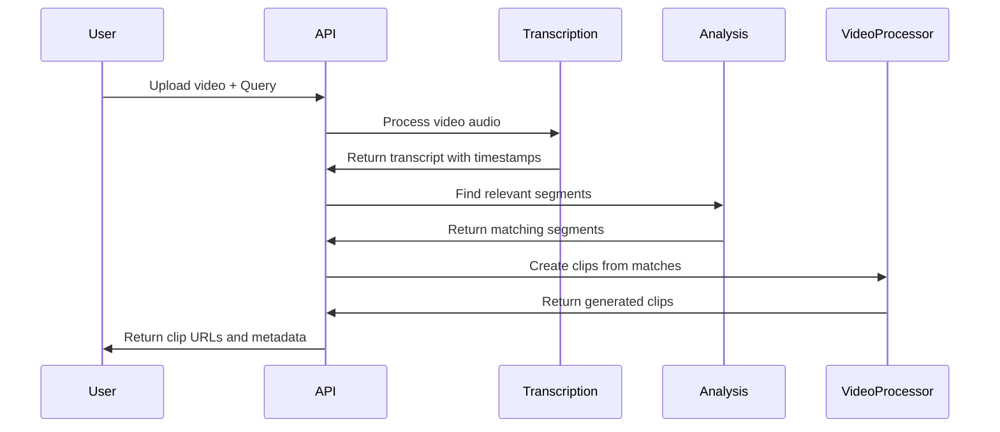
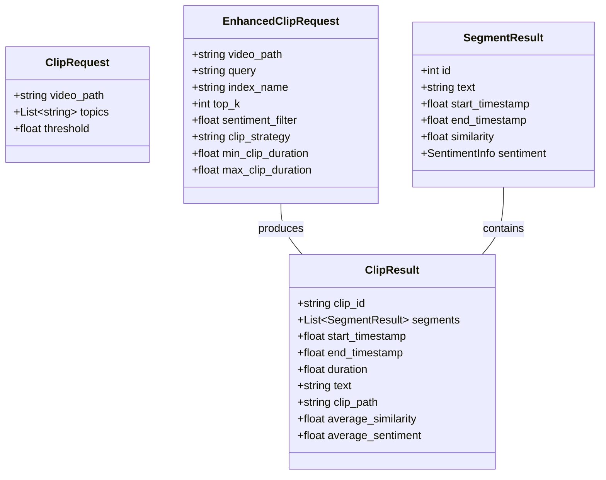
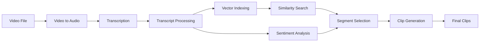

# Custom Video Clipper

An advanced AI-powered video processing system that automatically extracts relevant clips from longer videos based on content analysis, transcription, and semantic search.

## Overview

Custom Video Clipper is a comprehensive solution that uses AI techniques to analyze video content, extract meaningful clips, and create shareable short-form videos. The system processes videos through a pipeline that includes:

1. Video to audio conversion
2. Audio transcription with timestamps
3. Semantic analysis using vector embeddings
4. Sentiment analysis
5. Smart clip extraction and generation

The application is built with a modular architecture using FastAPI for the backend API.

## System Architecture



## Features

- **Video Transcription**: Automated transcription with word-level timestamps
- **Semantic Search**: Find content related to specific topics or themes using vector embeddings
- **Sentiment Analysis**: Filter clips based on sentiment (positive, negative, neutral)
- **Customizable Clip Generation**: Control clip length, format, and quality
- **API-first Design**: RESTful API for easy integration with other systems
- **Vector Indexing**: Store and search video content semantically

## Installation

### Prerequisites

- Python 3.10+
- FFmpeg
- Google Cloud credentials (for Gemini AI and speech services)

### Setup

1. Clone the repository:
```bash
git clone https://github.com/yourusername/CustomVideoClipperProject.git
cd CustomVideoClipperProject/VideoToShort
```

2. Create a virtual environment:
```bash
python -m venv venv
source venv/bin/activate  # On Windows: venv\Scripts\activate
```

3. Install dependencies:
```bash
pip install -r app/requirements.txt
```

4. Set up environment variables (create a `.env` file):
```
GEMINI_API_KEY=your_gemini_api_key
```

## Usage

### Running the API Server

```bash
cd app
uvicorn main:app --reload
```

The API will be available at http://localhost:8000. Swagger documentation is available at http://localhost:8000/docs.

### Basic Workflow



## API Endpoints

### Enhanced Processing

```
POST /api/enhanced/process
```

Process a video with enhanced AI capabilities:

```json
{
  "video_path": "/path/to/video.mp4",
  "query": "Explain the concept of AI",
  "top_k": 5,
  "sentiment_filter": 0.2,
  "min_clip_duration": 5.0,
  "max_clip_duration": 60.0
}
```

### Basic Processing

```
POST /api/process/clips
```

Process a video with basic keyword/phrase matching:

```json
{
  "video_path": "/path/to/video.mp4",
  "topics": ["AI", "machine learning", "neural networks"],
  "threshold": 0.6
}
```

## Data Models

The system uses various data models for processing:



## Core Components

### Transcription Service

Handles audio extraction and transcription using Google Cloud Speech-to-Text API. Provides word-level and sentence-level timestamped transcripts.

### Vector Index Service

Creates and manages vector embeddings for semantic search. Indexes transcripts for efficient similarity search.

### BERT/Gemini Analyzer

Uses BERT embeddings or Gemini AI for semantic analysis and text similarity.

### Sentiment Analyzer

Analyzes the sentiment of transcript segments to filter content based on emotional tone.

### Video Processor

Handles the actual cutting and formatting of video clips based on the identified segments.



## Configuration

The system configuration is centralized in `core/config.py` and includes:

- API keys and service credentials
- Output directory paths
- Logging settings
- Video processing parameters

## Logging

Comprehensive logging is implemented throughout the application. Logs are written to:

- Console (for development)
- `logs/app.log` (for production)

See `core/LOGGING_GUIDE.md` for details on the logging system.

## License

This project is licensed under the terms of the license included in the repository.

## Contributing

Contributions are welcome! Please feel free to submit a Pull Request.